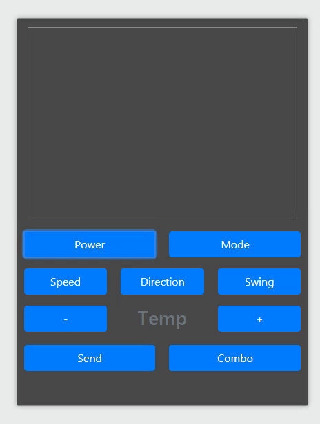
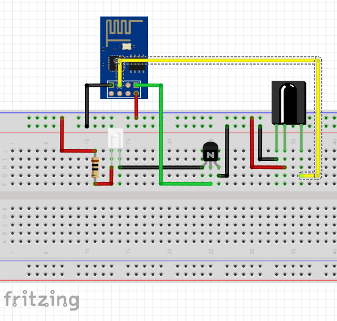
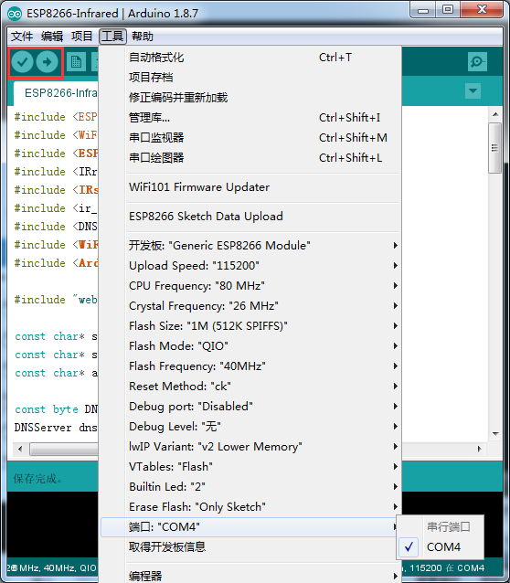
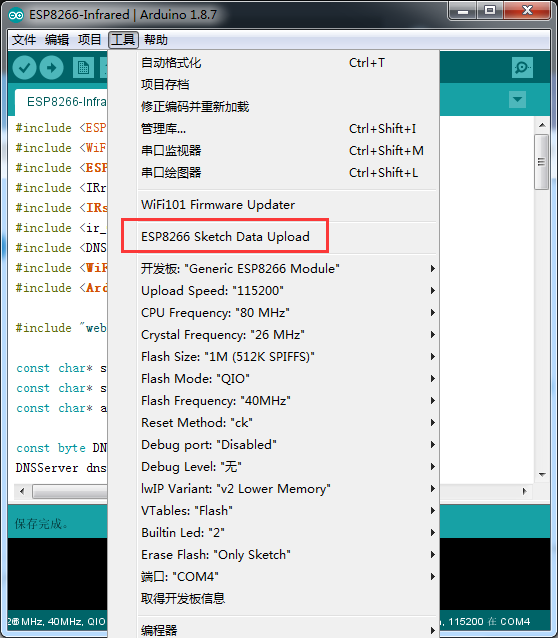

# ESP8266 Gree AC Controller

> Wireless Controller for Gree Air Conditioning 

<!-- TOC -->

- [ESP8266 Gree](#ESP8266-Gree-ac-controller)
    - [Introduction](#intro)
    - [Prerequisites](#prerequisites)
    - [How to compile](#how-to-compile)
    - [Related Projects](#related-projects)
	- [Contact](#contact)

## Intro

## Prerequisites

### 1. Hardware

You may reference:
> https://github.com/markszabo/IRremoteESP8266/wiki/ESP01-Send-&-Receive-Circuit

### 2. Sofware

- [Arduino (with ESP8266 support)](https://github.com/esp8266/Arduino)
- [Arduino-esp8266fs-plugin](https://github.com/esp8266/arduino-esp8266fs-plugin)

## How to Compile

1.Uploading Code

2.Uploading Web Page

3.Connect to Wireless "Gree-AC"

	http://192.168.4.1

## Related Projects

- IRremoteESP8266: https://github.com/markszabo/IRremoteESP8266

- arduino-esp8266fs-plugin: https://github.com/esp8266/arduino-esp8266fs-plugin

## Contact

* Author：Wu Han
* Homepage：http://wuhanstudio.cc
* Email：wuhanstudio@hust.edu.cn
